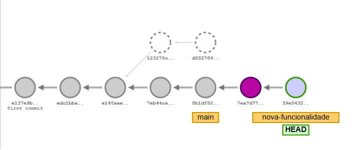

# Dicas de comandos GIT

Esse modelo tem como objetivo documentar comandos do Git afim de estudos.

## Comando: `git log --pretty` ou `git log --format`
**Descrição:** Visualização do histórico de commits em um formato customizável de acordo com as preferências do usuário.

---

## Comando: `git <comando> --help`
**Descrição:** Comando de ajuda que abre um manual para execução de cada comando GIT.

---

## Comando: `git log`
**Descrição:** Visualização padrão do histórico de commits.

---

## Comando: `git log --oneline`
**Descrição:** Visualização sucinta do histórico de commits.

---

## Comando: `git log -p`
**Descrição:** Visualização detalhada do histórico de commits.

---

## Comando: `git log --graph`
**Descrição:** Visualização do histórico de commits em forma de grafo que demonstra as ramificações dos commits, util quando trabalhamos com Branches.

---

## Comando: `git show <HASH>`
**Descrição:** Visualizar a alteração que o commit especificado pelo HASH fez, se um HASH não for passado será mostrado as alterações do último commit indicado pelo ponteiro HEAD.

---

## Comando: `git diff`
**Descrição:** Mostra a diferença entre dois estados, o que temos modificado sem termos adicionado para commitar e o nosso HEAD.

---

## Comando: `git diff <HASH 1>..<HASH 2>`
**Descrição:** Mostra a diferença entre dois commits, o primeiro é o mais antigo e o segundo o mais novo.

---

## Comando: `git status`
**Descrição:** Visualizar qual branch estamos e se há algo para ser adicionado ao Stage Area para seguir com o commit.

---

## Comando: `git branch`
**Descrição:** Visualiza todas as ramificações (Branches) da minha árvore de trabalho.

---

## Comando: `git branch <Branch>`
**Descrição:** Comando para criar uma nova branch. 

**Obs:** Esse comando apenas cria a nova branch mas não muda o ponteiro HEAD para ela.

---

## Comando: `git checkout <Branch>` (Antigo) ou `git switch <Branch>` (Novo)
**Descrição:** Comando para mudar para a branch especificada.

---

## Comando: `git checkout -b <Branch>` (Antigo) ou `git switch - c <Branch>` (Novo)
**Descrição:** Comando para criar uma Branch e já mover para ela.

---

## Comando: `git branch -m <Nome antigo da Branch> <Novo nome da Branch>`
**Descrição:** Comando para renomear uma branch já existente.

---

## Comando: `git branch -d <Branch>`
**Descrição:** Comando para deletar uma branch específica localmente. 

**Obs:** 
- Não é possível deletar a branch atual no qual o ponteiro HEAD se encontra.
- Esse comando deleta a branch do repositório local.

---

## Comando: `git push origin :<Branch>`
**Descrição:** Comando para deletar uma branch específica remotamente.

**Obs:** 
- Não é possível deletar a branch atual no qual o ponteiro HEAD se encontra.
- Esse comando deleta a branch do repositório remoto.

---

## Comando: `git merge <Branch>`
**Descrição:** Comando para mesclar uma branch.

**Obs:** 
- É necessário que o ponteiro HEAD esteja na Branch que deseja efetuar a mescla.
- O mege junta os trabalhos de duas branches, podendo gerar um merge commit.

---

## Comando: `git rebase <Branch>`
**Descrição:** Reescreve a história, o comando vai pegar todos os commits de uma ramificação e colocá-los em sequência na branch especificada.

**Obs:** 
- Aplica os commits de outra branch na branch atual.
- Os commits movidos terão um Hash diferente.

**Exemplo:**

---

## Comando: `git stash`
**Descrição:** Salva temporariamente as alterações não commitadas em uma área de armazenamento separada chamada "gaveta", permitindo que você volte a um estado limpo do repositório sem perder o progresso atual.

**Obs:** 
- Útil quando você precisa mudar de branch ou pausar o trabalho atual sem fazer um commit incompleto.

---

## Comando: `git stash push -m "<Mensagem>"`
**Descrição:** Cria uma stash descritiva, passando uma mensagem.

**Obs:** 
- Útil quando você precisa mudar de branch ou pausar o trabalho atual sem fazer um commit incompleto.

---

## Comando: `git stash pop`
**Descrição:** Recupera a última alteração salva no stash e remove essa entrada da pilha de stashes.

**Obs:** 
- O stash funciona como uma pilha, então este comando aplica e remove a stash mais recente.

---

## Comando: `git stash apply {indice da stash}`
**Descrição:** Aplica uma stash específica da pilha, identificada pelo seu índice, sem removê-la do stash.

---

## Comando: `git stash list`
**Descrição:** Exibe a lista de todas as alterações salvas no stash, em ordem cronológica reversa (da mais recente para a mais antiga).

---

## Comando: `git stash clear`
**Descrição:** Remove todas as entradas do stash, limpando completamente a pilha de alterações salvas.

---